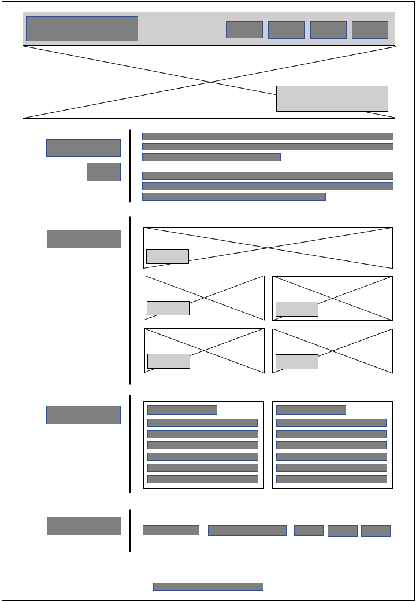
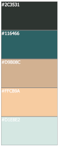

The website project 'lumiere' is a mock-up portfolio that showcases personal app projects to catch the eye of a potential employer. This portfolio itself should demonstrate necessary html and css skills as a web developer.

### User story  

An employer is looking for a potential candidate for an open position. The employer wants to view a portfolio website that includes the candidate's work samples.

### Acceptance criteria

- The portfolio should present the developer's name, photo and a navigation bar that allows me (as an employer) to peruse their professional profile, work, resume and contact information on the same page.

- Each navigation link should take me to the corresponding section.

- Particularly, when the 'work' link is clicked, an app collection should be presented with titles and associated images.

- When the mouse pointer hovers over the app (title or image), the image should be enlarged and brightened, much more noticeable than other app containers.

- When I click on the app(title or image), I am taken to the deployed app or its codebase.

- The site should have a reponsive layout, responding fluently to different viewports.

### Wireframe

At the beginning of the project, the wireframe was drawn to serve as the backbone of the site:

### Color palette

In terms of the feel of presentation, I choose the following color scheme: 

### Test

### Notes
